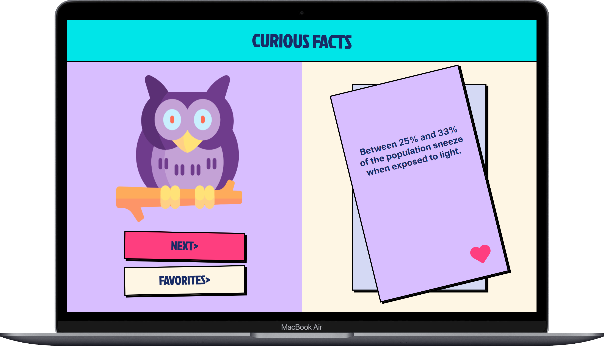
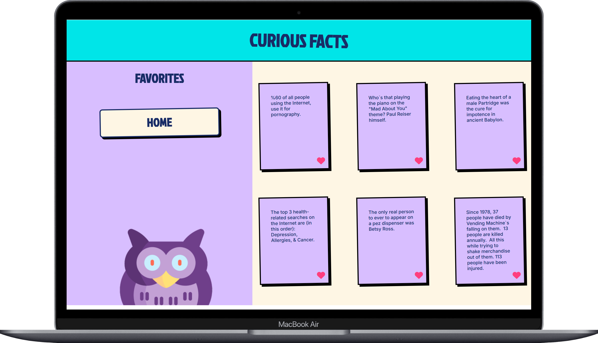

## Proyecto de Hechos curiosos

> [!NOTE]
> ## 🌐 Descripción:

- Hechos Curiosos es una aplicación web que proporciona datos fascinantes obtenidos de una API. Ofrece una experiencia interactiva donde los usuarios pueden explorar, guardar y eliminar curiosidades de manera sencilla.

## 👩‍💻 Tecnologías Utilizadas:
- JavaScript
- HTML
- CSS
- Vite
- Vitest

## 📁 Estructura de archivos:
- index.html: Representa nuestra única página (Single page Application)
- css/: Carpeta que contiene los estilos CSS del proyecto.
- js/: Carpeta que contiene los scripts JavaScript del proyecto manipularán el 
  contenido interactivo de nuestra página html mediante el manejo del DOM.
- assets/: Carpeta que almacena recursos multimedia como imágenes o iconos.
- test/: Carpeta que contiene el archivo encargado del testing de nuestro 
  proyecto.

## 📚 Funcionalidades:

- 🔄 Consulta Aleatoria: Obtén datos curiosos aleatorios al hacer clic en "Obtener Curiosidad."
- ⭐ Guardado de Favoritos: Marca tus curiosidades preferidas con un simple clic en la estrella.
- 🗑️ Eliminación Intuitiva: Elimina curiosidades de la lista con facilidad usando el ícono de eliminar.

>[!IMPORTANT]
>## 🛠 Instrucciones de Instalación:

1. Clona este repositorio en la carpeta deseada con el comando `git clone`: 
  https://github.com/tephyxp/curious-facts-project.git

2. Para ejecutar las pruebas con Vitest, sigue estos pasos:
- Abre una terminal y navega hasta la carpeta del proyecto.
- Ejecuta el siguiente comando para instalar las dependencias necesarias:
  ```
  npm install
  ```
- Una vez instaladas las dependencias, puedes ejecutar las pruebas con el comando:
  ```
  npm test
  ```

## 📝 Instrucciones de Uso: 

- Abre index.html en tu navegador web.
- Explora datos curiosos al hacer clic en "Obtener Curiosidad."
- Marca tus favoritos con el ícono de estrella.
- Elimina curiosidades con el ícono de eliminar.

## Demo de la página 




## 👩‍💻 Desarrolladoras:

Alicia Ontiveros - [perfil Linkedin](https://www.linkedin.com/in/alicia-ontiveros-escudero)

Stefania Georgescu - [perfil Linkedin](http://www.linkedin.com/in/stefania-georgescu-602700112)

Grecia Landazuri - [perfil Linkedin](https://www.linkedin.com/in/grecialh/)

Stephanie Céspedes - [Perfil Linkedin](https://www.linkedin.com/in/stephanie-cespedes)


>[!TIP]
>## 🚀 Desarrollo y Contribuciones

🎖 ¡Contribuye al desarrollo de esta aplicación siguiendo estos pasos!

1. Forkea el repositorio.
2. Clona tu repositorio forkeado localmente.
3. Crea una rama nueva: git checkout -b nombre-de-la-rama.
4. Realiza cambios y haz commits descriptivos.
5. Sube la rama a tu repositorio forkeado: git push origin nombre-de-la-rama.
6. Abre un pull request en el repositorio original.

¡Gracias por tu contribución!
