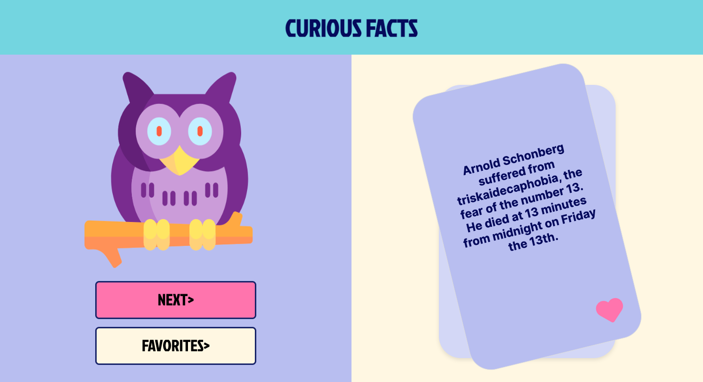

## Curious Facts Project
> [!NOTE]  
> 🌐 Description:
> 
> Curious Facts is a web application that provides fascinating data obtained from an API. It offers an interactive experience where users  
  can explore, save, and delete curiosities easily.

## 👩‍💻 Technologies Used:
- JavaScript
- HTML
- CSS
- Vite
- Vitest

## 📁 File Structure:

- Index.html: Represents our single page (Single-page Application)
- css/: Folder containing project's CSS styles.
- js/: Folder containing JavaScript scripts that will manipulate the 
  interactive content of our html page through DOM manipulation.
- assets/: Folder storing multimedia resources such as images or icons.
- test/: Folder containing the file responsible for testing our project.

## 📚 Features:

- 🔄 Random Query: Get random curious data by clicking "Get Curiosity."
- ⭐ Favorites Save: Mark your favorite curiosities with a simple click on the 
star.
- 🗑️ Intuitive Deletion: Easily delete curiosities from the list using the delete icon.

<<<<<<< HEAD
_[!IMPORTANT]_

## 🛠 Installation Instructions:
=======
>[!IMPORTANT]
> ## 🛠 Installation Instructions:
>>>>>>> 800199708189e107c10233c70098001641328d7b

Clone this repository into the desired folder using the git clone command:
https://github.com/tephyxp/curious-facts-project.git

To run tests with Vitest, follow these steps:

1. Open a terminal and navigate to the project folder.
2. Run the following command to install necessary dependencies:
  ```
  npm install
  ```
3. Once the dependencies are installed, you can run the tests using the command:
  ```
  npm test
  ```
## 📝 Usage Instructions:
1. Open index.html in your web browser.
2. Explore curious data by clicking "Get Curiosity."
3. Mark your favorites with the star icon.
4. Delete curiosities using the delete icon.

## Page Demo
 

## 👩‍💻 Developers:

Alicia Ontiveros - [Linkedin profile](https://www.linkedin.com/in/alicia-ontiveros-escudero)

Stefania Georgescu - [Linkedin profile](http://www.linkedin.com/in/stefania-georgescu-602700112)

Grecia Landazuri - [Linkedin profile](https://www.linkedin.com/in/grecialh/)

Stephanie Céspedes - [Linkedin profile](https://www.linkedin.com/in/stephanie-cespedes)


<<<<<<< HEAD

_[!TIP]_
=======
>[!TIP]
>## 🚀 Development and Contributions
>>>>>>> 800199708189e107c10233c70098001641328d7b

🎖 Contribute to the development of this application by following these steps!

Fork the repository.
Clone your forked repository locally.
Create a new branch: git checkout -b branch-name.
Make changes and commit descriptive messages.
Push the branch to your forked repository: git push origin branch-name.
Open a pull request in the original repository.
Thank you for your contribution!

---------------------------------------------------------------------------------------------------------------------------------------------------------------------------------------------------------------------------------------

## Proyecto de Hechos curiosos

> [!NOTE]
> ## 🌐 Descripción:

- Hechos Curiosos es una aplicación web que proporciona datos fascinantes obtenidos de una API. Ofrece una experiencia interactiva donde los usuarios pueden explorar, guardar y eliminar curiosidades de manera sencilla.

## 👩‍💻 Tecnologías Utilizadas:
- JavaScript
- HTML
- CSS
- Vite
- Vitest

## 📁 Estructura de archivos:
- index.html: Representa nuestra única página (Single page Application)
- css/: Carpeta que contiene los estilos CSS del proyecto.
- js/: Carpeta que contiene los scripts JavaScript del proyecto manipularán el 
  contenido interactivo de nuestra página html mediante el manejo del DOM.
- assets/: Carpeta que almacena recursos multimedia como imágenes o iconos.
- test/: Carpeta que contiene el archivo encargado del testing de nuestro 
  proyecto.

## 📚 Funcionalidades:

- 🔄 Consulta Aleatoria: Obtén datos curiosos aleatorios al hacer clic en "Obtener Curiosidad."
- ⭐ Guardado de Favoritos: Marca tus curiosidades preferidas con un simple clic en la estrella.
- 🗑️ Eliminación Intuitiva: Elimina curiosidades de la lista con facilidad usando el ícono de eliminar.

<<<<<<< HEAD
>_[!IMPORTANT]_

## 🛠 Instrucciones de Instalación:
=======
>[!IMPORTANT]
>## 🛠 Instrucciones de Instalación:
>>>>>>> 800199708189e107c10233c70098001641328d7b

1. Clona este repositorio en la carpeta deseada con el comando `git clone`: 
  https://github.com/tephyxp/curious-facts-project.git

2. Para ejecutar las pruebas con Vitest, sigue estos pasos:
- Abre una terminal y navega hasta la carpeta del proyecto.
- Ejecuta el siguiente comando para instalar las dependencias necesarias:
  ```
  npm install
  ```
- Una vez instaladas las dependencias, puedes ejecutar las pruebas con el comando:
  ```
  npm test
  ```

## 📝 Instrucciones de Uso: 

- Abre index.html en tu navegador web.
- Explora datos curiosos al hacer clic en "Obtener Curiosidad."
- Marca tus favoritos con el ícono de estrella.
- Elimina curiosidades con el ícono de eliminar.

## Demo de la página 


## 👩‍💻 Desarrolladoras:

Alicia Ontiveros - [perfil Linkedin](https://www.linkedin.com/in/alicia-ontiveros-escudero)

Stefania Georgescu - [perfil Linkedin](http://www.linkedin.com/in/stefania-georgescu-602700112)

Grecia Landazuri - [perfil Linkedin](https://www.linkedin.com/in/grecialh/)

Stephanie Céspedes - [Perfil Linkedin](https://www.linkedin.com/in/stephanie-cespedes)
<<<<<<< HEAD
@

_[!TIP]_
=======
>>>>>>> 800199708189e107c10233c70098001641328d7b


>[!TIP]
>## 🚀 Desarrollo y Contribuciones

🎖 ¡Contribuye al desarrollo de esta aplicación siguiendo estos pasos!

1. Forkea el repositorio.
2. Clona tu repositorio forkeado localmente.
3. Crea una rama nueva: git checkout -b nombre-de-la-rama.
4. Realiza cambios y haz commits descriptivos.
5. Sube la rama a tu repositorio forkeado: git push origin nombre-de-la-rama.
6. Abre un pull request en el repositorio original.

¡Gracias por tu contribución!
